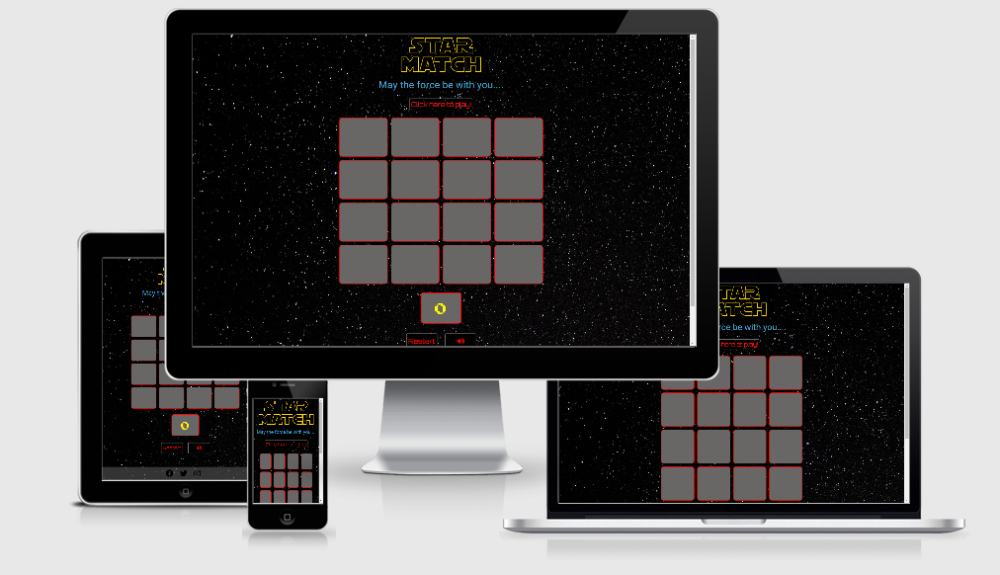
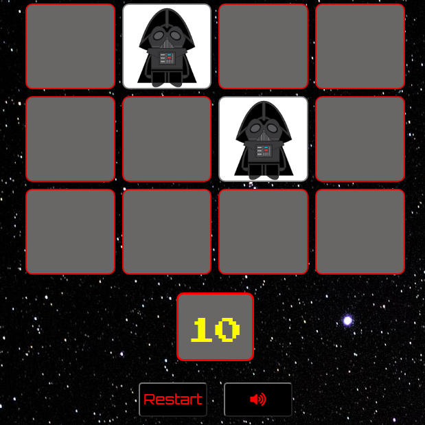
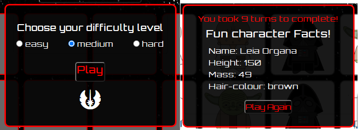
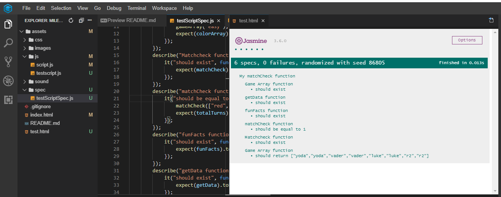

# **STAR MATCH**

This project is a Star Wars themed memory match game. The game is designed to help
as a brain training tool to primarily strengthen memory whilst also being fun to play.

The game is more geared towards Star Wars fans and provides Star Wars themed visual 
and audio with the intention of improving the overall playing experience. 

## UX

Memory match games have been shown to be an effective brain training tool, especially
improving:
* concentration
* shorterm memory
* attention to detail 
* finding similarities and differences in objects

By visiting this site the user should achieve the following:  
* be able to easily navigate through the site with minimum difficulty 
* be able to modify settings to suit user requirements 
* have feedback on how well the user is performing
* have a fun experience while playing
* be exposed to general Star Wars character facts

A wireframe was constructed using balsamique wireframes. It can be found  [here](assets/doc/wireframe.pdf).

## FEATURES

The site consists of a one page design made up of logo, card grid system, control buttons, counter and
footer. Two modals have also been included.

### Grid system

The card grid system forms the main part of the site whereby the user can select a pair of cards.
The design also includes a hover effect to assist the user is knowing which card will be selected.

### Control buttons

2 control button were included. The restart button permits the user to reset the game and sound icon
removes/adds sound effects.

### Counter

A counter was included to provide the user with a running count of every turn made.

### Modal

Two modals were included. The first one permits the user to choose a difficulty level
which would change the size of card grid system. The second modal permits the user to obtain 
stats on the number of turns required to complete game, Star Wars character fact and a button to 
play again.

### footer

A footer was added and incoporated social links to:
* official Star Wars facebook site
* official Star Wars twitter site
* official Star Wars Istagram site

## TECHNOLOGIES USED

* HTML
* css 
* javacript
* Jquery to simplify DOM manipulation
* official W3C validator
* css official validator(jigsaw)
* JSHint 
* Jasmine testing framwork
* chrome dev tools
* Bootstrap 4 for page layout purposes and responsive design aspects
* balsamiq wireframes application

## JAVASCRIPT MAIN GAME CODE DESIGN PHILOSOPHY

The code logic behind the main game was as follow:
* determine grid size my selecting difficulty level which would hide or expose div elements which specific ID's.
* provide the attribute of '.card' and '.character' to the class of all card elements using a for loop.
The '.card' class would be situated below '.character' class in css to make it the dominant class.
* select two cards.
* once the two cards are selected remove the class attribute of '.card', which would expose the '.character' class.
* Compare remaining class attribute of the two selected cards.
* if the remaining class attribute are the same remove click prpoerty for the selected cards and increase match count by 1.
* if the remaining class attribute are not the same return the attribute of card back which would hide the character class
once again.
* sequence continues until all character class exposed identified by the match count and grid size. 

## TESTING 

The following provides details of testing performed

### UX testing

The goals setout in the UX section were accomplished as follows: 

1. Be able to easily navigate through the site with minimum difficulty 
The site design used straight forward user friendly step-by-step guides to help the user navigate
the options with minimum difficulty. This was achieved by the use of modals and text changes.
For example once the user selected "click here to play' a modal would open to allow the user
input the next requirement being level select. Also the text "click here to play" changes to 
"match the cards" indicating that the game has started.
2. Be able to modify settings to suit user requirement 
This was primarily achieved by providing a level select option which would change difficulty levels.
There is also a sound on/off and restart button to modify settings. 
3. Have feedback on how well the user is performing 
This was achieved by audio and visual means. Firsly a specific audio can be heard if the match is correct or
not. Secondly a counter is provided indicating how many turns have been taken which can be used as a
baseline for future game attempts.
4. Have a fun experience while playing.   
This was achieved by using Star Wars design which made the game more visually appealing.
5. Be exposed to general Star Wars character facts 
This was achieved by using Star Wars API from https://swapi.dev/. This would provide a random character
fact highlighting the characters name, height, weight, and hair-clour.

### Validators
Code errors were checked with the following validators:
* official W3C validator
* css official validator(jigsaw)
* JSHint 

All passed sucessfully.

### Jasmine unit testing
Some testing using Jasmine framework was performed during game development on the main javascript to ensure 
functions were defined and output were correct. Tests were successful.

### Game testing

Game was tested among friends and relative and feedback provided and adjustments made. For example an audio
sound effect was added when cards did not match.

### Reponsive design

Site was viewed on different device sizes to check for correct reponsive design. This was done primarily
using Dev tools and then finally using the website http://ami.responsivedesign.is/.  

### Issues Encountered during testing

1. Once a specific card was clicked it could be selected again causing card game logic to breakdown. This was 
resolved by adding a condition in the click function whereby clicked card could not be seleted again. 
2. Once the game was reset using the restart button the game logic would breakdown. Problem was identified
with one of the conditions contained in the click function. Problem Was resolved by changing ($(this).attr("class")).length)>=5 to
($(this).attr("class")).length)>=6.
3. The Star Wars character funfact at the end of the game would not show up if a status 404 was obtained.
To resolve this issue an if/else statement was included so that if a status 404 was obtained a default character fact would 
appear. Character chosen was Luke Skywalker. This was further tested by providing an incorrect URL to the getdata function 
and checking output. 
4. After second card selection, if the cards did not match, the both cards would flip immediately back. This would not give sufficient
time for the user to identify which card was selected. This issue was resolved by adding a setTimeout function.

## DEPLOYMENT
Gitpod was used as an online IDE and then pushed to GITHUB for [hosting](https://zahur76.github.io/MilestoneProject2/).

## FUTURE IMPROVEMENTS

Add an option with a countdown function which the user can choose to add another level of difficulty to the game.

## CREDITS

### Content

* Star Wars character facts obtained from https://swapi.dev/.
* Code used from dev.to to assist in footer placement 

### Media

* Sound clips were obtained from https://www.101soundboards.com/.
* card images obtained from Etsy.com
* logo obtained from https://flamingtext.com/.

### Acknowledgment

