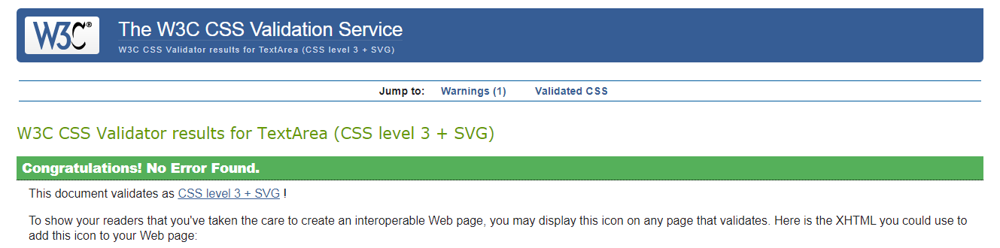
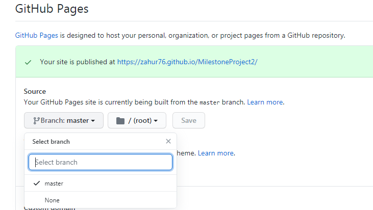

# **STAR MATCH**

This project is a Star Wars themed memory match game. The game objective is to match the
cards with a minimum  amount of tries. The game can also be used as a brain training tool 
to primarily strengthen memory whilst also being fun to play.

The game is more geared towards Star Wars fans and incorportes Star Wars themed images 
and audio with the intention of improving the overall playing experience. 

## UX

Memory match games have been shown to be an effective brain training tool, especially
improving:
* concentration
* shorterm memory
* attention to detail 
* finding similarities and differences in objects

By visiting this site the user should achieve the following:  
* be able to navigate through the site with minimal difficulty. 
* be able to modify settings to suit user requirements. 
* have feedback on how well the user is performing.
* have a fun experience while playing.
* be exposed to general Star Wars character facts.

A wireframe was constructed using balsamique wireframes. It can be found  [here](assets/doc/wireframe.pdf).

## FEATURES

The site consists of a one page design made up of a logo, card grid system, control buttons, counter and
footer. Two modals have also been included for selection purposes.

### Grid system

The card grid system forms the main part of the site whereby the user can select a pair of cards for comparison.
The design also includes a hover effect to assist the user is knowing which card will be selected.

### Control buttons

2 control buttons were included. The restart button permits the user to reset the game whilst the sound button
removes/adds sound effects.

### Counter

A counter was included to provide the user with a running count of every turn made.

### Modal

Two modals were included. The first one permits the user to choose a difficulty level
which would change the size of card grid system before starting game. The second modal contained
stats on the number of turns required to complete the game, Star Wars character fact and a button to 
play again.

### footer

A footer was added which incoporated social links to:
* official Star Wars facebook site
* official Star Wars twitter site
* official Star Wars Istagram site

## TECHNOLOGIES USED

* HTML
* css 
* javacript
* Jquery to simplify DOM manipulation
* official W3C validator to check HTML syntax
* css official validator(jigsaw) to check css syntax
* JSHint to check javacript syntax 
* Jasmine testing framework for unit testing
* chrome developers tools for analysing scripts and debugging
* Bootstrap 4 for page layout purposes and responsive design aspects
* balsamiq wireframes application to create the site design

## JAVASCRIPT MAIN GAME CODE DESIGN LOGIC

The code logic behind the main game was as follow:
* Determine grid size my selecting difficulty level which would hide or expose div elements which specific classes.
* Provide the attribute of '.card' and '.character' to the class of all card elements using a for loop.
The '.card' class would be situated below '.character' class in css to make it the dominant class.
* Select two cards. 
* For each card selected the class attribute of '.card' would be removed using removeClass method, which would expose the '.character' class.
* A Comparison of the remaining class attribute of the two selected cards is performed.
* If the remaining class attribute for two cards are the same then the off click method (.off("click") would be applied and match count icreased by 1.
* If the remaining class attribute are not the same the class attribute of ".card" would be added back which would hide the character class.
* sequence continues until all '.character' classes are exposed which is identified by using match count and grid size. 

## TESTING 

The following provides details of testing performed during development.

### UX testing

The goals set out in the UX section were accomplished as follows: 

1. Be able to navigate through the site with minimal difficulty 
The site design used straight forward user friendly step-by-step guides to help the user navigate
the options with ease. This was achieved by the use of modals and text changes.
For example once the user selected "click here to play' a modal would open to allow the user to
input the next required field being level select. Also the text "click here to play" changes to 
"match the cards" indicating that the game has started. This was further tested by allowing test 
users to play the game with minimum prompting.
2. Be able to modify settings to suit user requirement 
This was primarily achieved by providing a level select option which would change the card grid size and hence difficulty.
There is also a sound on/off and restart button to modify settings. 
3. Have feedback on how well the user is performing 
This was achieved by audio and visual means. Firsly a specific audio can be heard if the match is correct or
not. Secondly a counter is provided indicating how many turns have been taken which can be used as a
baseline for future game attempts.
4. Have a fun experience while playing.   
This was achieved by using Star Wars themed design which made the game more visually appealing.
5. Be exposed to general Star Wars character facts 
This was achieved by using Star Wars API from https://swapi.dev/. This would provide a random character
fact highlighting the characters name, height, weight, and hair-clour.

### Validators
Code syntax were checked for errors with the following validators:
* official W3C validator
* css official validator(jigsaw)
* JSHint 

All tests passed sucessfully except for Jshint with the warning "	'let' is available in ES6 (use 'esversion: 6') or Mozilla JS extensions (use moz).". 
This is due to the syntax used for defining variables.

### Jasmine unit testing
Some testing using Jasmine framework was performed during game development on the main javascript to ensure 
functions were defined and output were correct. Tests were successful.

### Game testing

The game was tested with friends and relatives and feedback provided. Consequently adjustments were then made. For example an audio
sound effect was added when cards did not match.

### Reponsive design

Site was viewed on different device sizes to check for correct reponsive design. This was done primarily
using Dev tools and then finally using the website http://ami.responsivedesign.is/.  

### Issues Encountered during development 

1. Once a specific card was clicked it could be selected again causing card game logic to breakdown. This was 
resolved by adding a condition in the click function whereby clicked card could not be seleted again. 
2. Once the game was reset using the restart button the game logic would breakdown. Problem was identified
with one of the conditions contained in the click function. Problem Was resolved by changing ($(this).attr("class")).length)>=5 to
($(this).attr("class")).length)>=6.
3. The Star Wars character funfact at the end of the game would not show up if a status 404 was obtained.
To resolve this issue an if/else statement was included so that if a status 404 was obtained a default character fact would 
appear. Character chosen was Luke Skywalker. This was further tested by providing an incorrect URL to the getdata function 
and checking output. 
4. After second card selection, if the cards did not match, the both cards would flip immediately back. This would not give sufficient
time for the user to identify which card was selected. This issue was resolved by adding a setTimeout function.
5. On the level select modal the play button could be pressed without a level being selected. To counter this problem 
a condition was added to activate the play button only when a level was selected.

## DEPLOYMENT
Gitpod was used as an online IDE and then pushed to GITHUB for [hosting](https://zahur76.github.io/MilestoneProject2/).

To deploy the project on github pages the following steps were used:
1. Login to Github and select the the MilestoneProject2 repository.
2. Press the setting button on the top menu bar located on the right-hand side.

3. Scroll down to the Github pages section and select Master branch from the dropdown menu and press save.

4. Once completed an active link is published for the repository. 

## FUTURE IMPROVEMENTS

Add a countdown option to add another level of difficulty to the game.

## CREDITS

### Content

* Star Wars character facts obtained from https://swapi.dev/.
* Code used from dev.to to assist in footer placement 

### Media

* Sound clips were obtained from https://www.101soundboards.com/.
* card images obtained from Etsy.com
* logo obtained from https://flamingtext.com/.

### Acknowledgment

